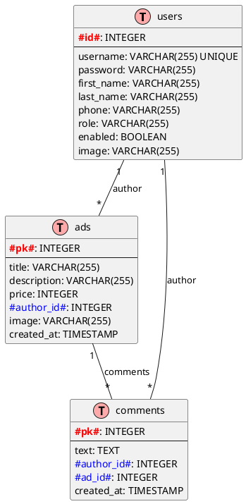
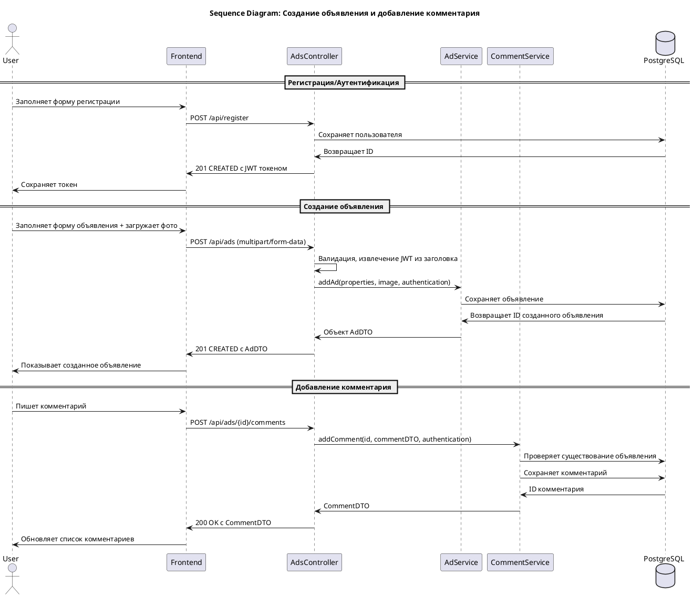
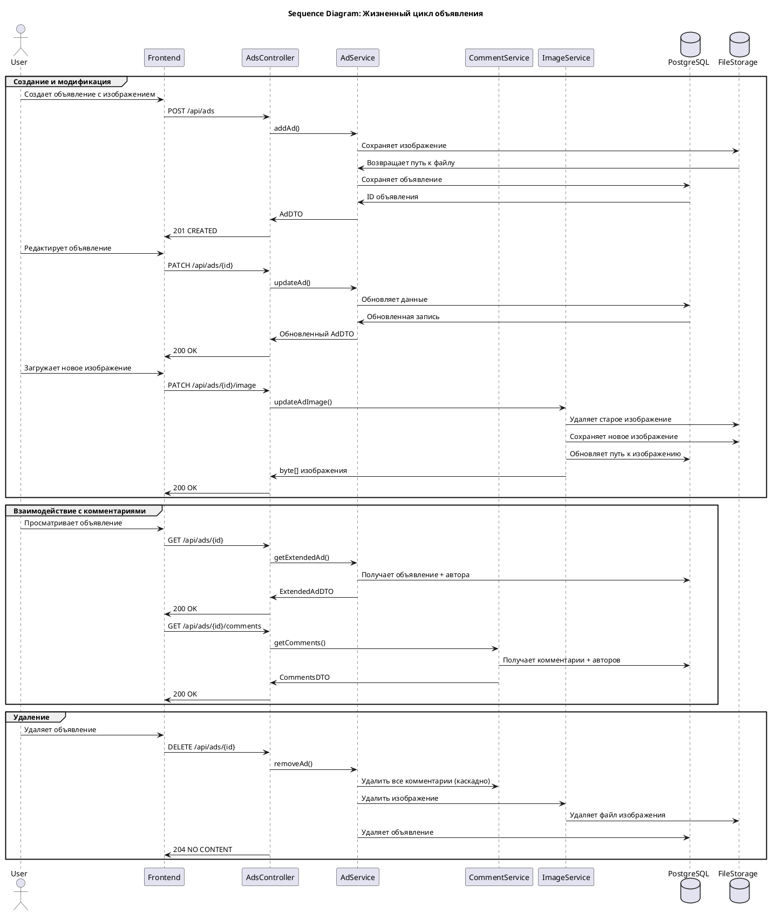
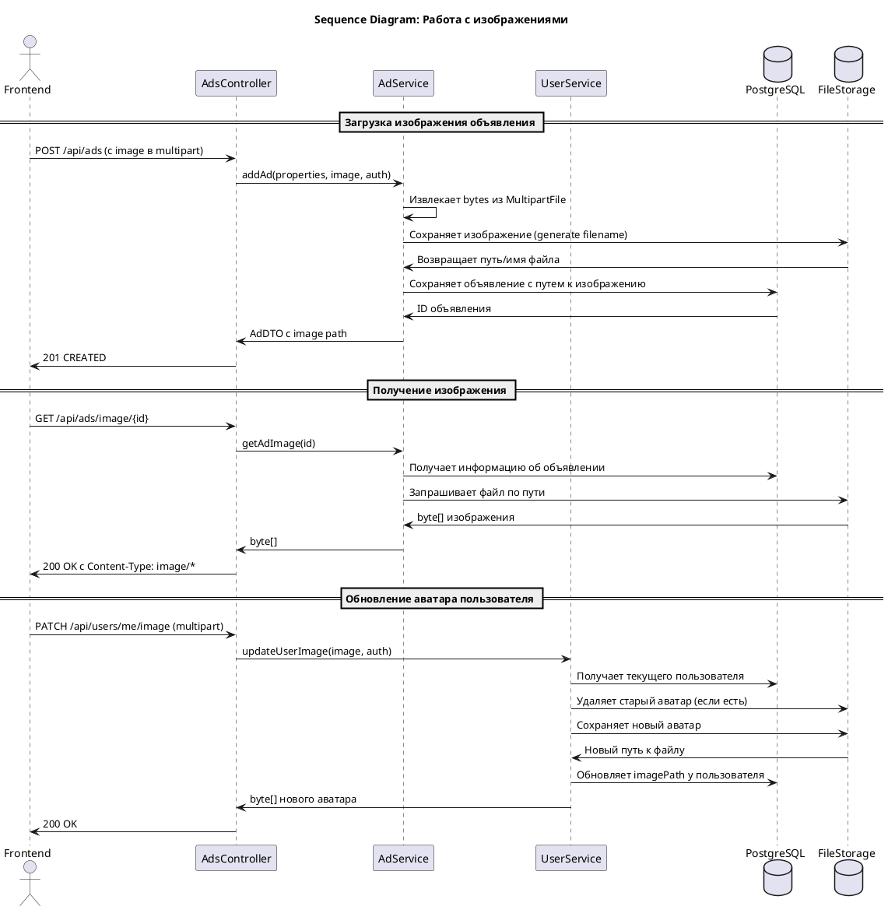
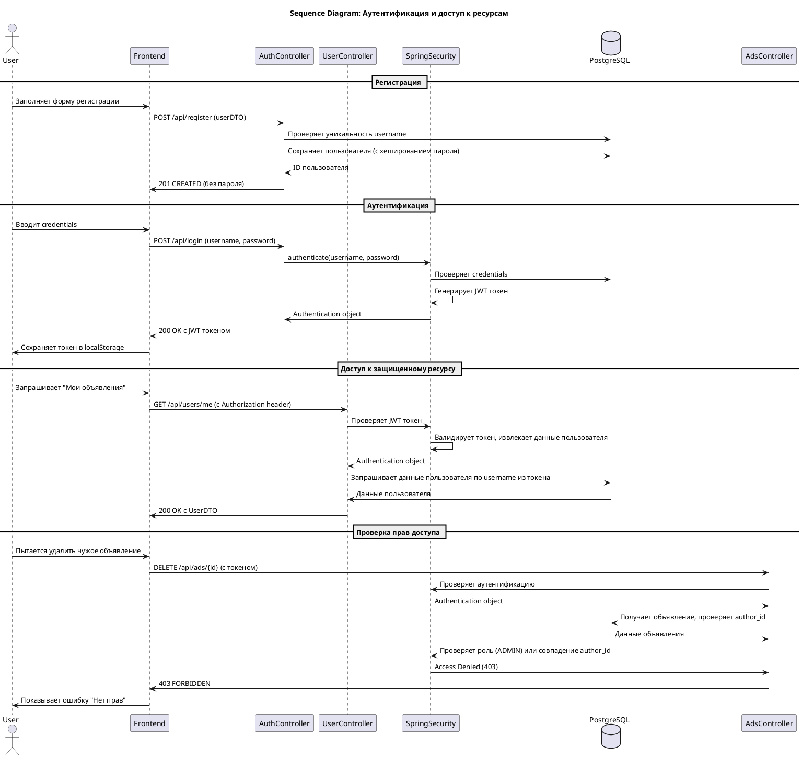

Материалы для выполнения курсовой работы учениками профессии java-разработчик.

# 🏠 Ads Platform - Дипломный проект

Платформа для размещения объявлений с комментариями и изображениями.

## 📋 Оглавление
- [Технологический стек](#технологический-стек)
- [Архитектура](#архитектура)
- [Архитектура](#архитектура) 
- [Установка и запуск](#установка-и-запуск)
- [API Endpoints](#api-endpoints)
- [База данных](#база-данных)
- [Примеры использования](#примеры-использования)
- [Схемы взаимодействия](#схемы-взаимодействия)
- [Безопасность](#безопасность)
- [Тестирование](#тестирование)
- [Деплой](#деплой)
- [Мониторинг](#мониторинг)
- [Вклад в проект](#вклад-в-проект)

## 🛠 Технологический стек

### Backend
- **Java 17** - основной язык разработки
- **Spring Boot 2.7.15** - фреймворк
- **Spring Security** - аутентификация и авторизация
- **Spring Data JPA** - работа с базой данных
- **PostgreSQL** - основная база данных
- **H2 Database** - тестовая база данных (для разработки)
- **Hibernate** - ORM

### Frontend
- **React** (предположительно, судя по CORS настройкам)
- Работает на порту 3000

### Инструменты
- **Maven** - сборка проекта
- **Lombok** - уменьшение boilerplate кода
- **MapStruct** - маппинг DTO
- **SLF4J/Logback** - логирование

## 🏗 Архитектура

### Структура проекта
```
src/main/java/ru/skypro/homework/
├── controller/          # REST контроллеры
│   ├── AdsController.java
│   ├── AuthController.java
│   └── UserController.java
├── dto/                # Data Transfer Objects
│   ├── ad/
│   ├── comment/
│   └── user/
├── entity/             # JPA сущности
│   ├── Ad.java
│   ├── Comment.java
│   └── User.java
├── repository/         # Spring Data репозитории
├── service/            # Бизнес-логика
│   ├── AdService.java
│   ├── CommentService.java
│   └── UserService.java
├── mapper/             # MapStruct мапперы
├── config/             # Конфигурационные классы
├── security/           # Spring Security настройки
└── HomeworkApplication.java
```

### Принципы проектирования
- **RESTful API** - соблюдение REST принципов
- **Слоистая архитектура** (Controller-Service-Repository)
- **DTO Pattern** - отделение внутренней модели от API
- **Dependency Injection** - через Spring

## 🚀 Установка и запуск

### Требования
- Java 17+
- PostgreSQL 14+
- Maven 3.6+
- Node.js 16+ (для фронтенда)

### 1. Настройка базы данных
```sql
-- Создание базы данных
CREATE DATABASE ads_db;

-- Создание пользователя (опционально)
CREATE USER app_user WITH PASSWORD 'password';
GRANT ALL PRIVILEGES ON DATABASE ads_db TO app_user;
```

### 2. Конфигурация приложения
Создайте `application.properties` в `src/main/resources/`:
```properties
# Server
server.port=8080
server.servlet.context-path=/api

# Database
spring.datasource.url=jdbc:postgresql://localhost:5432/ads_db
spring.datasource.username=postgres
spring.datasource.password=your_password
spring.datasource.driver-class-name=org.postgresql.Driver

# JPA
spring.jpa.hibernate.ddl-auto=update
spring.jpa.show-sql=true
spring.jpa.properties.hibernate.dialect=org.hibernate.dialect.PostgreSQLDialect
spring.jpa.properties.hibernate.format_sql=true

# CORS для фронтенда
cors.allowed-origins=http://localhost:3000

# Security (для разработки)
security.enabled=true
```

### 3. Сборка и запуск
```bash
# Сборка проекта
mvn clean package

# Запуск приложения
java -jar target/graduate_work-1.0-SNAPSHOT.jar

# Или запуск через Maven
mvn spring-boot:run
```

### 4. Для разработки с H2
```properties
# Временная конфигурация для тестирования
spring.datasource.url=jdbc:h2:mem:testdb
spring.datasource.driver-class-name=org.h2.Driver
spring.datasource.username=sa
spring.datasource.password=
spring.jpa.database-platform=org.hibernate.dialect.H2Dialect
spring.h2.console.enabled=true
spring.h2.console.path=/h2-console
```

## 📡 API Endpoints

### Аутентификация
| Метод | Endpoint | Описание | Аутентификация |
|-------|----------|----------|----------------|
| POST | `/api/login` | Вход в систему | Не требуется |
| POST | `/api/register` | Регистрация | Не требуется |

### Объявления (Ads)
| Метод | Endpoint | Описание | Аутентификация |
|-------|----------|----------|----------------|
| GET | `/api/ads` | Получить все объявления | Не требуется |
| POST | `/api/ads` | Создать объявление | Требуется |
| GET | `/api/ads/{id}` | Получить объявление по ID | Не требуется |
| DELETE | `/api/ads/{id}` | Удалить объявление | Требуется (владелец/админ) |
| PATCH | `/api/ads/{id}` | Обновить объявление | Требуется (владелец/админ) |
| GET | `/api/ads/me` | Мои объявления | Требуется |

### Комментарии
| Метод | Endpoint | Описание | Аутентификация |
|-------|----------|----------|----------------|
| GET | `/api/ads/{id}/comments` | Комментарии объявления | Не требуется |
| POST | `/api/ads/{id}/comments` | Добавить комментарий | Требуется |
| DELETE | `/api/ads/{adId}/comments/{commentId}` | Удалить комментарий | Требуется (владелец/админ) |
| PATCH | `/api/ads/{adId}/comments/{commentId}` | Обновить комментарий | Требуется (владелец/админ) |

### Пользователи
| Метод | Endpoint | Описание | Аутентификация |
|-------|----------|----------|----------------|
| GET | `/api/users/me` | Получить свой профиль | Требуется |
| PATCH | `/api/users/me` | Обновить профиль | Требуется |
| PATCH | `/api/users/me/image` | Обновить аватар | Требуется |
| GET | `/api/users/{id}/image` | Получить аватар | Не требуется |

### Изображения
| Метод | Endpoint | Описание | Аутентификация |
|-------|----------|----------|----------------|
| PATCH | `/api/ads/{id}/image` | Обновить изображение объявления | Требуется (владелец/админ) |
| GET | `/api/ads/image/{id}` | Получить изображение объявления | Не требуется |

## 🗄 База данных

### ER-диаграмма


### Создание таблиц
```sql
-- Пользователи
CREATE TABLE users (
    id SERIAL PRIMARY KEY,
    username VARCHAR(255) UNIQUE NOT NULL,
    password VARCHAR(255) NOT NULL,
    first_name VARCHAR(255) NOT NULL,
    last_name VARCHAR(255) NOT NULL,
    phone VARCHAR(255),
    role VARCHAR(255) NOT NULL,
    enabled BOOLEAN NOT NULL DEFAULT true,
    image VARCHAR(255)
);

-- Объявления
CREATE TABLE ads (
    pk SERIAL PRIMARY KEY,
    title VARCHAR(255) NOT NULL,
    description TEXT,
    price INTEGER NOT NULL,
    author_id INTEGER NOT NULL REFERENCES users(id) ON DELETE CASCADE,
    image VARCHAR(255),
    created_at TIMESTAMP DEFAULT CURRENT_TIMESTAMP
);

-- Комментарии
CREATE TABLE comments (
    pk SERIAL PRIMARY KEY,
    text TEXT NOT NULL,
    author_id INTEGER NOT NULL REFERENCES users(id) ON DELETE CASCADE,
    ad_id INTEGER NOT NULL REFERENCES ads(pk) ON DELETE CASCADE,
    created_at TIMESTAMP DEFAULT CURRENT_TIMESTAMP
);
```

## 📊 Примеры использования

### Регистрация пользователя
```bash
curl -X POST http://localhost:8080/api/register \
  -H "Content-Type: application/json" \
  -d '{
    "username": "user@example.com",
    "password": "password123",
    "firstName": "Иван",
    "lastName": "Иванов",
    "phone": "+79998887766",
    "role": "USER"
  }'
```

### Создание объявления
```bash
curl -X POST http://localhost:8080/api/ads \
  -H "Authorization: Bearer YOUR_JWT_TOKEN" \
  -H "Content-Type: multipart/form-data" \
  -F "properties={\"title\":\"Продам велосипед\",\"description\":\"Отличный горный велосипед\",\"price\":15000};type=application/json" \
  -F "image=@bicycle.jpg"
```

### Получение всех объявлений
```bash
curl -X GET http://localhost:8080/api/ads
```

## 🔄 Схемы взаимодействия

### 1. Создание объявления с комментарием


### 2. Полный жизненный цикл объявления


### 3. Работа с изображениями


### 4. Процесс аутентификации и авторизации


## 🔒 Безопасность

### Роли пользователей
- **USER** - обычный пользователь (может создавать объявления, комментировать)
- **ADMIN** - администратор (все права + управление пользователями)

### Защита endpoints
- **Публичные**: GET /api/ads, GET /api/ads/{id}, GET /api/ads/{id}/comments
- **Требуют аутентификации**: POST/PATCH/DELETE операции
- **Проверка владения**: пользователь может изменять только свои ресурсы

### JWT токены
- Используются для stateless аутентификации
- Время жизни: 24 часа
- Хранятся в localStorage фронтенда

## 🧪 Тестирование

### Запуск тестов
```bash
# Все тесты
mvn test

# С покрытием кода
mvn jacoco:report
```

### Примеры тестов
- **Unit тесты** сервисов
- **Integration тесты** контроллеров
- **Тесты безопасности** (роли и доступ)

## 🚢 Деплой

### Docker контейнеризация
```dockerfile
FROM openjdk:17-jdk-slim
WORKDIR /app
COPY target/graduate_work-1.0-SNAPSHOT.jar app.jar
EXPOSE 8080
ENTRYPOINT ["java", "-jar", "app.jar"]
```

### Docker Compose
```yaml
version: '3.8'
services:
  postgres:
    image: postgres:14
    environment:
      POSTGRES_DB: ads_db
      POSTGRES_USER: postgres
      POSTGRES_PASSWORD: password
    ports:
      - "5432:5432"
    volumes:
      - postgres_data:/var/lib/postgresql/data
  
  app:
    build: .
    ports:
      - "8080:8080"
    environment:
      SPRING_DATASOURCE_URL: jdbc:postgresql://postgres:5432/ads_db
      SPRING_DATASOURCE_USERNAME: postgres
      SPRING_DATASOURCE_PASSWORD: password
    depends_on:
      - postgres

volumes:
  postgres_data:
```

## 📈 Мониторинг

### Health checks
```bash
# Проверка здоровья приложения
curl http://localhost:8080/api/actuator/health

# Информация о приложении
curl http://localhost:8080/api/actuator/info
```

### Логирование
- Уровень логирования настраивается в `application.properties`
- Логи хранятся в файлах с ротацией по размеру/времени

## 🤝 Вклад в проект

### Code style
- Java Code Conventions
- Использование Lombok для геттеров/сеттеров
- MapStruct для маппинга DTO

### Git workflow
1. Создать feature branch от `main`
2. Реализовать функциональность
3. Написать тесты
4. Создать Pull Request
5. Code review
6. Мердж в `main`

---

